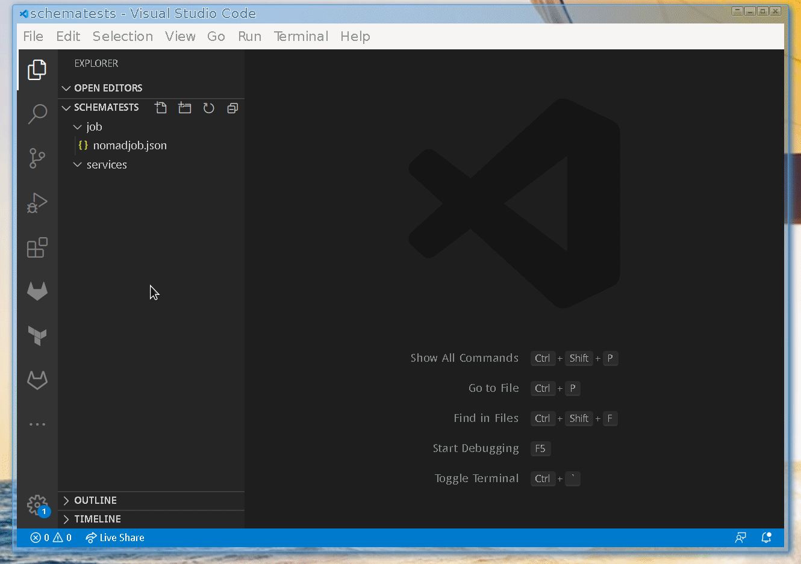

# Hashicorp Schemas
Hashicorp schemas and unofficial specs for payload validation and autocompletion.  These can be used within IDEs for autocompletion or within web frameworks like json-editor. They can act as universal IDE or Visual Studio Code extensions / plugins for Hashicorp JSON documents like Vault, Packer, Consul, Nomad, etc.

```
{
    "$schema": "https://github.com/jboero/hashicorp-schemas/raw/master/JSON/vault/config.json",
    [CTRL-SPACE]
}
```

For VS Code, enable a schema by defining the "$schema" value at the root of any new JSON file or configure json schemas for directory matching in the settings.json file.  Note that some objects have a "requires" property which helpfully tells you when some missing attributes are required. Unfortunately in VS Code autocompletion the validation on new objects fails as they don't contain the required properties. Sometimes you won't find the object in your "type" autocompletion list. Just type it anyway and Code will figure out the schema after you do.
```
{
    "editor.suggestSelection": "first",
    "vsintellicode.modify.editor.suggestSelection": "automaticallyOverrodeDefaultValue",
    "window.zoomLevel": -1,
    "explorer.confirmDelete": false,
    "terminal.integrated.fontFamily": "Menlo for Powerline",
    "go.formatTool": "goimports",
    "go.useLanguageServer": true,
    "debug.onTaskErrors": "debugAnyway",
    "json.schemas": [
        {
            "fileMatch": [
                "./job/*.json"
            ],
            "url": "https://github.com/jboero/hashicorp-schemas/raw/master/JSON/nomad/1.11/job.json"
        },
        {
            "fileMatch": [
                "./services/*.json"
            ],
            "url": "https://github.com/jboero/hashicorp-schemas/raw/master/JSON/consul/1.8/service.json"
        }
    ],
}
```



